Homie built a CNC router (or CNC mill, depending on who you ask)!

The mechanical components are based on the open-source Shapeoko 2 design, and the electrical components are custom.

This page details some of the technical aspects of the machine.

Here is a picture of the entire system:

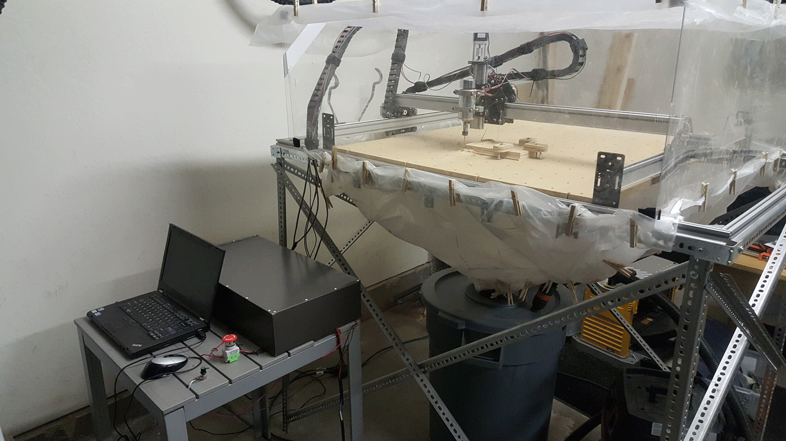

A command to the CNC machine begins at a PC. Homie installed open-source software called [Universal G-Code Sender](https://github.com/winder/Universal-G-Code-Sender) on this computer.

This software sends individual CNC G-code commands, as well as entire CNC programs, via a serial connection to an Arduino microcontroller which governs motion control. Here is a picture of the microcontroller:

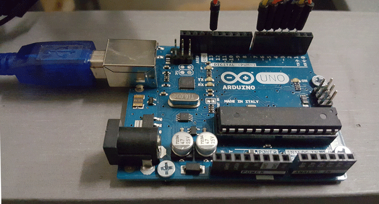

Homie installed open-source motion control software called [GRBL](https://github.com/grbl/grbl) on the microcontroller hardware. 

This software interprets G-Codes and determines how to control steps of the X, Y, and Z stepper motors to achieve the programmed motion. 

The motion control software programs the microcontroller to send binary digital signals to an MA860H motor driver circuit. Each of the X, Y, and Z motion axes have their own motor driver circuit. Here is a picture of a connected motor driver circuit:

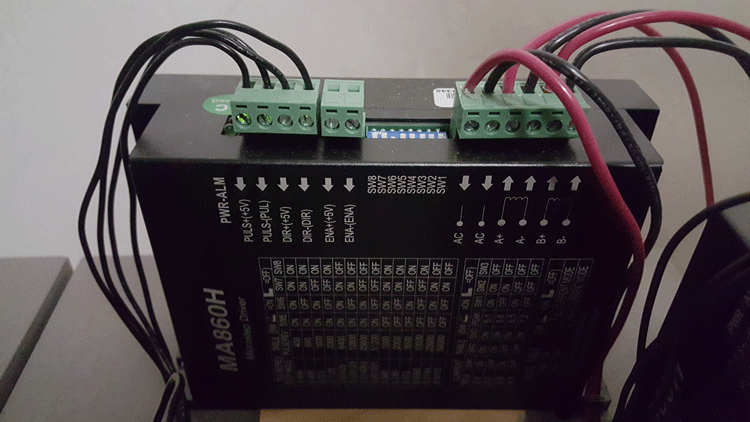

A 5V stable signal across the DIR terminals instructs the motor that the upcoming motion will be in the clockwise direction, and a 0.5V stable signal instructs for counter-clockwise motion.

A 5V pulse signal across the PUL terminals instructs the motor to move one step, and a 0.5V pulse signal instructs it to stay stationary.

When the motor driver circuit receives a direction signal coupled with a pulse signal, it closes a power supply circuit with one pair of stator coils of the stepper motor, causing the rotor to move one step.

Homie configured the motion control software with the information that a certain number of motor steps corresponds with a given amount of mechanical motion along a single axis. 

Specifically, the stepper motor driver circuit is configured for microstepping at 800 steps per revolution. The pulleys that transfer motion along the X and Y axes have 20 teeth with a pitch of 2mm, resulting in 40mm of travel from one full revolution. So, Homie configured the motion control software to move the X or Y motor 800/40 = 20 steps to achieve 1mm of motion along that axis. The smallest resolution of motion in X or Y is 1/20 mm, or approximately 0.002". Here is a picture of a Y motion pulley:

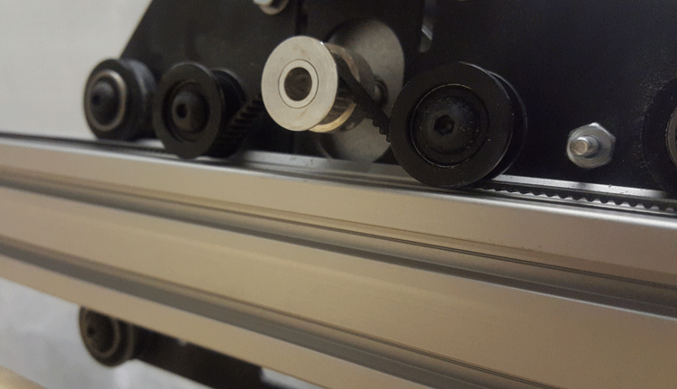

Z motion is transferred from a stepper motor to the spindle via a fine-pitch lead screw that transfers 0.8mm of vertical motion per full revolution. This allows a lower microstep setting on the motor driver circuit, which allows for greater torque per step while still maintaining precise motion resolution. Homie set the Z motor driver circuit to 400 motor steps per revolution, resulting in 400/0.8 = 500 steps to achieve 1mm of motion along the Z axis. The smallest resolution of motion in Z is 1/500mm, or approximately 0.0001". Here is a picture of the Z motion lead screw:

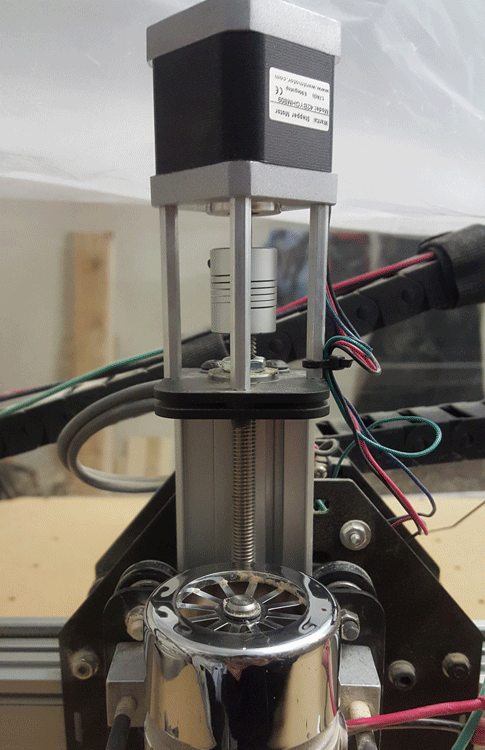

The power supply to the motors is 48V DC, which is converted from grid-supplied 110V 60Hz AC by a toroidal transformer. An emergency stop button cuts off all power to the motors and spindle when pressed. Here is a picture of the power supply and emergency stop button:

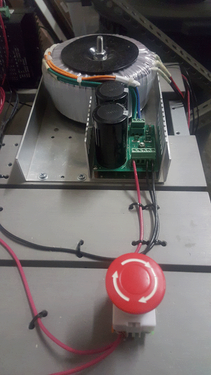

The power supply also supplies power through a spindle control circuit underneath the table. A potentiometer (not pictured), which is connected to the spindle control circuit, allows for manual control of spindle rotation speed. Here is a picture of the spindle control circuit:

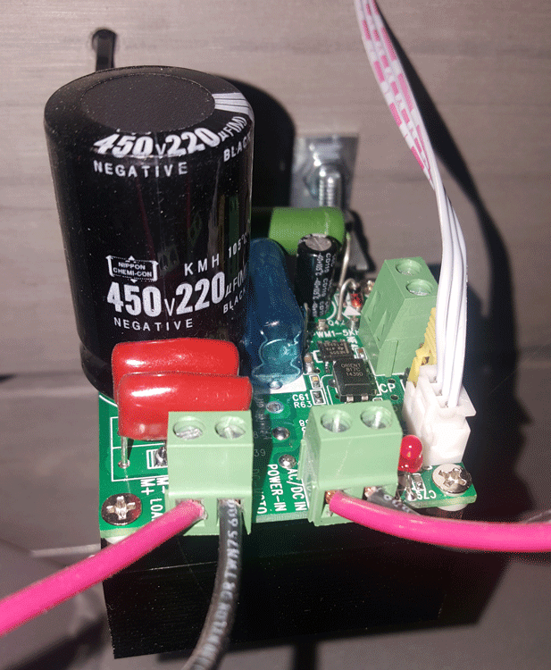

To reduce the exposure of dust to the control electronics and power supply, Homie built a simple sheet metal enclosure:

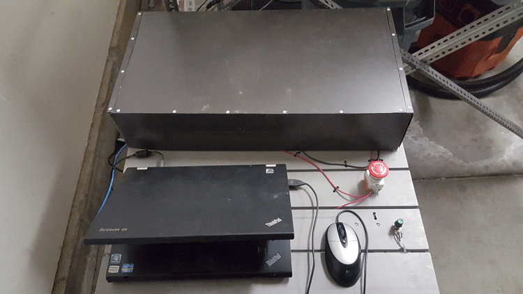

Homie's first use of the machine was to make a flat surface to mount a workholding table on. To do this, Homie coded a Ruby application with the intention of programming customizable climb-milling toolpaths for machining flat surfaces. The source code and a more detailed description of the software is available [here](https://github.com/nicholasedwards/Face-Miller), and a video snippet of the machining is available [here](https://www.youtube.com/watch?v=xK7AqyGdtgA). Here is a picture of the flat pads for mounting the workholding table on:

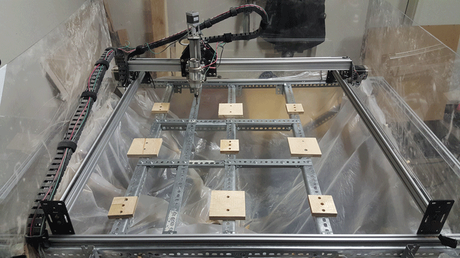

Homie then glued a flat MDF board with pre-drilled holes on these pads. Here is a picture of the workholding table which workpieces can be clamped onto:

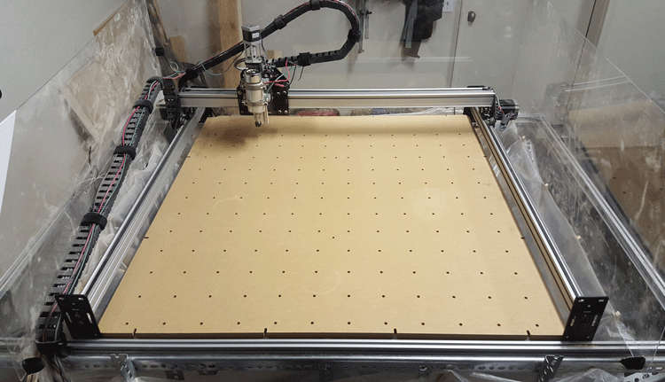

Homie also made a set of workholding clamps to mount workpieces onto the table. Although clamp pieces are commercially available, Homie opted for a more customizable solution. Homie coded a Ruby application to generate CNC programs for machining various customizable sizes of clamps. The source code is available [here](https://github.com/edwardsCNC/Mill-Clamp). Here is a picture of a setup for machining a clamp:

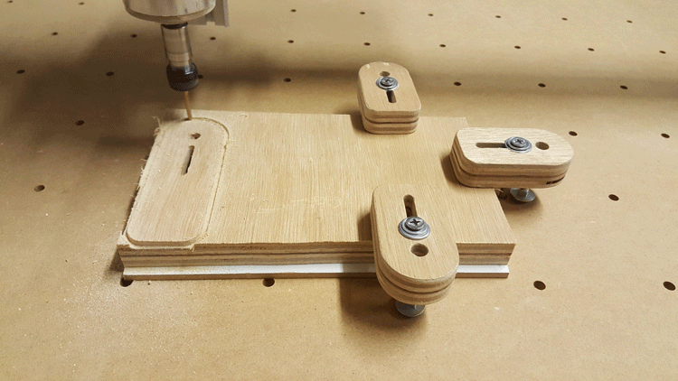

Homie may use this machine to carve wooden pieces for making furniture and musical instruments. Check again later!